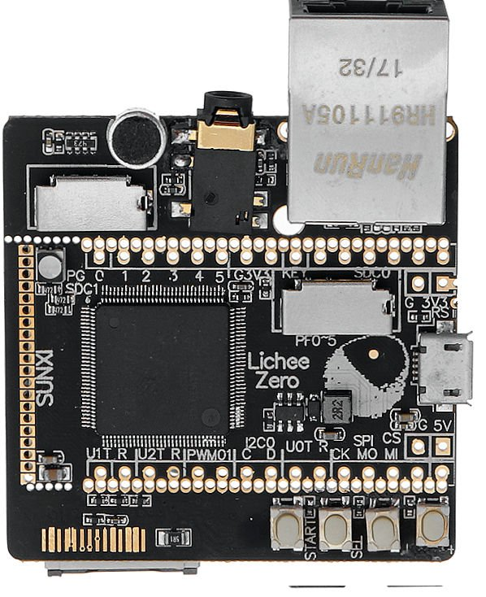

# meta-licheepizero

## Instruction how to build an image for Lichee Pi Zero and Lichee Pi Zero Dock in Yocto

### Products:

  
Lichee Pi Zero Version  
 
  
Lichee Pi Zero Dock Version  
 

## General Note:
Assumed that Linux Ubuntu is installed

## List of tested elements

WiFi  
Ethernet  
Lcd  
Touchscreen  
Led   
Backlight for Lcd  

## List of not tested elements

Bluetooth - appears during system boot up  
Microphone  
Headphone  

## How to build an images

1. First make sure to following packages are installed in system

    ***sudo apt-get install gawk wget git-core diffstat unzip texinfo gcc-multilib build-essential chrpath socat libsdl1.2-dev xterm***

    **Note:**
    More informations can be found on Yocto reference manual.

2. Download necessary Yocto packaged listed below

	***git clone git://git.yoctoproject.org/poky --depth 1 -b zeus***  
    ***cd poky***  
	***git clone git://git.openembedded.org/meta-openembedded --depth 1 -b zeus***  
	***git clone https://github.com/meta-qt5/meta-qt5.git --depth 1 -b zeus***  
	***git clone https://github.com/voloviq/meta-licheepizero --depth 1 -b zeus***  

3. Select directory to build Linux

    Zero version  
	***source oe-init-build-env ~/yocto/build/licheepizero***  
    Zero Dock version  
	***source oe-init-build-env ~/yocto/build/licheepizero-dock***  

4. Modify bblayers.conf(located in ~/yocto/build/licheepizero/conf(or licheepizero-dock/conf)) PATH if necessary

    *BBLAYERS ?= " \
      ${HOME}/yocto/poky/meta <\>
      ${HOME}/yocto/poky/meta-poky
      ${HOME}/yocto/poky/meta-openembedded/meta-oe
      ${HOME}/yocto/poky/meta-openembedded/meta-networking
      ${HOME}/yocto/poky/meta-openembedded/meta-python
      ${HOME}/yocto/poky/meta-qt5
      ${HOME}/yocto/poky/meta-licheepizero
      "* 

    **Note:** Please adapt PATH of conf/bblayers.conf if necessary.  

5. Modify local.conf(located in ~/yocto/build/licheepizero/conf(or licheepizero-dock/conf)) file

    - modify line with "MACHINE ??" to add "licheepizero-dock" or "licheepizero"

    - align *DL_DIR = "${HOME}/yocto/downloads"*  

    - align *SSSTATE_DIR = "${HOME}/yocto/sstate-cache"*  
    
    - align *TMPDIR = "${HOME}/yocto/tmp"*  
    
    - add at the end following records  
    	**RM_OLD_IMAGE = "1"**  
	**INHERIT += "rm_work"**  

    **Note:** Please adapt rest of conf/local.conf parameters if necessary.  

6. Build objects

    - console image  
      ***bitbake console-image***  

    - qt5 image  
      ***bitbake qt5-image***  

    - qt5 toolchain sdk  
      ***bitbake meta-toolchain-qt5***  

7. After compilation images appears in

    Zero version  
	*~/yocto/tmp/deploy/images/licheepizero*  
    Zero Dock version  
	*~/yocto/tmp/deploy/images/licheepizero-dock*  

8. Insert SD CARD into dedicated CARD slot and issue following command to write an image

    **Note:**  
    Be 100% sure to provide a valid device name (of=/dev/**sde**). Wrong name "/dev/sde" dameage Your system file !    
        Zero version  
    	***sudo dd if=~/yocto/tmp/deploy/images/licheepizero/qt5-image-licheepizero.sunxi-sdimg of=/dev/sde bs=1024***  
    	Zero Dock verison  
    	***sudo dd if=~/yocto/tmp/deploy/images/licheepizero-dock/qt5-image-licheepizero-dock.sunxi-sdimg of=/dev/sde bs=1024***  

# Limitation

	- sunxi_mali is probably not working
	- rootfs-resize not working (SD CARD size can be resized manualy)
	- no wiringpi or similar library to driver GPIO in C code
	- discover problem when WiFi connected to access point (probably some drivers issues), nevertheless WiFi works
